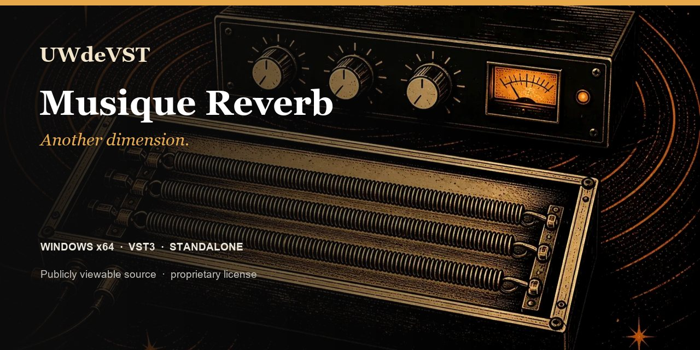

<!-- UWDEVST-SHOWCASE:START -->

  

<h1 align="center">Musique Reverb</h1>

<strong>Another dimension.</strong> From a close room to open space, place every sound in a setting of its own.

  <a href="https://unicorsoundengine.com/en/plugins/fx-reverb#listen">Listen</a> ·
  <a href="https://unicorsoundengine.com/en/plugins/fx-reverb#install">Download</a> ·
  <a href="https://unicorsoundengine.com/en">Full collection</a> ·
  <a href="https://github.com/unicornwhodev/fx-reverb/issues/new/choose">Report an issue</a>

**Windows x64 · VST3 · Standalone**

- Room, Plate, Hall, Chamber and Space
- Size, diffusion, pre-delay and ducking
- Eco, Studio and High modes

> **Publicly viewable source — proprietary license.** Official binaries are free for individuals and organizations with no more than EUR 100,000 in worldwide consolidated gross revenue. Modification and redistribution are not permitted. Professional use above that threshold requires a paid written license. [Read the license](https://unicorsoundengine.com/en/license) or [request a commercial license](https://unicorsoundengine.com/en/contact).

The license included with each tagged release governs that release. The v1.0 license applies prospectively and does not withdraw permissions already granted on earlier releases.
<!-- UWDEVST-SHOWCASE:END -->

---

# Musique Reverb

Musique Reverb is a Windows ambience and space effect for room, plate, hall, chamber and spacious reverb sounds. It is available as a Standalone application and a VST3 plug-in.

## Formats

- Windows x64 Standalone
- Windows x64 VST3

## Install a release

1. Download the Windows installer or portable ZIP from this repository's Releases page.
2. Run the installer, or extract the ZIP and copy the complete .vst3 bundle to a VST3 location scanned by your host.
3. Rescan plug-ins in the host, then insert the effect on the track or bus you want to process.

## Reverb controls

Choose from Room, Plate, Hall, Chamber and Space algorithms, then shape the result with:

- Size, Decay and PreDelay.
- Damping, Diffusion and stereo Width.
- Early and tail level balance.
- Low-cut and high-cut filters.
- Modulation depth and rate.
- Ducking and ducking release.
- Eco, Studio and High quality modes.
- Mix, Output, Freeze, Bypass and Mono controls.

For a send, begin with Mix fully wet in the host's return channel. For insert use, choose a lower Mix value and level-match with Output.

## Factory presets

The 18 presets cover studio rooms, drums, vocal plates, piano and scoring halls, guitar ambience, synth space, freeze, mono ambience, backing-vocal halo and lo-fi plate sounds.

## Build from source

Requirements: Windows x64, PowerShell, Git, CMake 3.22 or later, Visual Studio 2022 (or Build Tools) with Desktop development with C++, and JUCE 8.0.4.

~~~powershell
.\_build_all.ps1 -Configuration Release -BootstrapJuce
~~~

To use an existing JUCE 8.0.4 checkout:

~~~powershell
.\_build_all.ps1 -Configuration Release -JuceDir C:\Dev\JUCE
~~~

The build produces Standalone and VST3 artefacts.

## Package a local build

~~~powershell
.\_package_release.ps1 -Configuration Release -BootstrapJuce
~~~

The script creates a portable Windows package and, when Inno Setup 6 is installed, a Windows installer. Use the SkipInstaller option when an installer is not required.

## Repository contents

| Path | Purpose |
| --- | --- |
| Source/ | Plug-in source, effect engines and visual assets |
| Presets/ | Factory preset bank |
| FXShared/ | Local shared UI and audio helpers required by this plug-in |
| installer/ | Windows installer definition |

## Licence and support

The source code is publicly viewable under a proprietary license. Viewing and private compilation of strictly unchanged source are permitted; modification and redistribution are not. See [LICENSE.md](LICENSE.md). For a released-build issue, open an issue with the Windows version, host name/version, plug-in format and steps to reproduce it.
